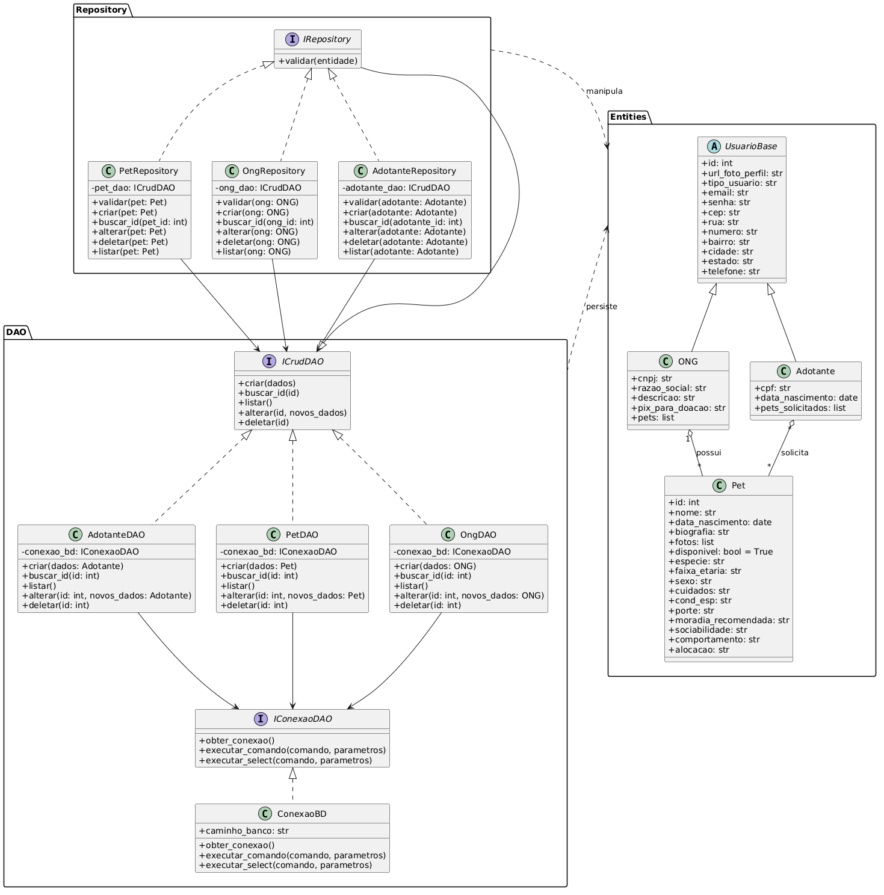
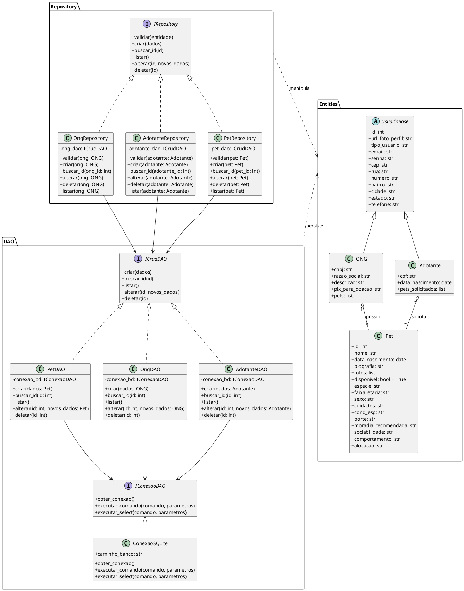

# Modelagem das classes de domínio

## Diagrama de classes de domínio

## Código PlantUML:

```plantuml
@startuml
skinparam classAttributeIconSize 0

package "Entities" {
    abstract class UsuarioBase {
        +id: int
        +url_foto_perfil: str
        +tipo_usuario: str
        +email: str
        +senha: str
        +cep: str
        +rua: str
        +numero: str
        +bairro: str
        +cidade: str
        +estado: str
        +telefone: str
    }

    class ONG {
        +cnpj: str
        +razao_social: str
        +descricao: str
        +pix_para_doacao: str
        +pets: list
    }

    class Adotante {
        +cpf: str
        +data_nascimento: date
        +pets_solicitados: list
    }

    class Pet {
        +id: int
        +nome: str
        +data_nascimento: date
        +biografia: str
        +fotos: list
        +disponivel: bool = True
        +especie: str
        +faixa_etaria: str
        +sexo: str
        +cuidados: str
        +cond_esp: str
        +porte: str
        +moradia_recomendada: str
        +sociabilidade: str
        +comportamento: str
        +alocacao: str
    }

    UsuarioBase <|-- ONG
    UsuarioBase <|-- Adotante

    ONG "1" o-- "*" Pet : possui
    Adotante "*" o-- "*" Pet : solicita
}

package "DAO" {
    interface IConexaoDAO {
        +obter_conexao()
        +executar_comando(comando, parametros)
        +executar_select(comando, parametros)
    }

    class ConexaoSQLite {
        +caminho_banco: str
        +obter_conexao()
        +executar_comando(comando, parametros)
        +executar_select(comando, parametros)
    }

    interface ICrudDAO {
        +criar(dados)
        +buscar_id(id)
        +listar()
        +alterar(id, novos_dados)
        +deletar(id)
    }

    class PetDAO {
        -conexao_bd: IConexaoDAO
        +criar(dados: Pet)
        +buscar_id(id: int)
        +listar()
        +alterar(id: int, novos_dados: Pet)
        +deletar(id: int)
    }

    class OngDAO {
        -conexao_bd: IConexaoDAO
        +criar(dados: ONG)
        +buscar_id(id: int)
        +listar()
        +alterar(id: int, novos_dados: ONG)
        +deletar(id: int)
    }

    class AdotanteDAO {
        -conexao_bd: IConexaoDAO
        +criar(dados: Adotante)
        +buscar_id(id: int)
        +listar()
        +alterar(id: int, novos_dados: Adotante)
        +deletar(id: int)
    }

    IConexaoDAO <|.. ConexaoSQLite
    ICrudDAO <|.. PetDAO
    ICrudDAO <|.. OngDAO
    ICrudDAO <|.. AdotanteDAO

    PetDAO -down-> IConexaoDAO
    OngDAO -down-> IConexaoDAO
    AdotanteDAO -down-> IConexaoDAO
}

package "Repository" {
    interface IRepository {
        +validar(entidade)
        +criar(dados)
        +buscar_id(id)
        +listar()
        +alterar(id, novos_dados)
        +deletar(id)
    }

    class PetRepository {
        -pet_dao: ICrudDAO
        +validar(pet: Pet)
        +criar(pet: Pet)
        +buscar_id(pet_id: int)
        +alterar(pet: Pet)
        +deletar(pet: Pet)
        +listar(pet: Pet)
    }

    class OngRepository {
        -ong_dao: ICrudDAO
        +validar(ong: ONG)
        +criar(ong: ONG)
        +buscar_id(ong_id: int)
        +alterar(ong: ONG)
        +deletar(ong: ONG)
        +listar(ong: ONG)
    }

    class AdotanteRepository {
        -adotante_dao: ICrudDAO
        +validar(adotante: Adotante)
        +criar(adotante: Adotante)
        +buscar_id(adotante_id: int)
        +alterar(adotante: Adotante)
        +deletar(adotante: Adotante)
        +listar(adotante: Adotante)
    }

    IRepository <|.. PetRepository
    IRepository <|.. OngRepository
    IRepository <|.. AdotanteRepository

    PetRepository -down-> ICrudDAO
    OngRepository -down-> ICrudDAO
    AdotanteRepository -down-> ICrudDAO
}

' Orientação entre pacotes
Entities -[hidden]down-> Repository
Repository -[hidden]right-> DAO

Repository ..> Entities : manipula
DAO ..> Entities : persiste

@enduml
```
